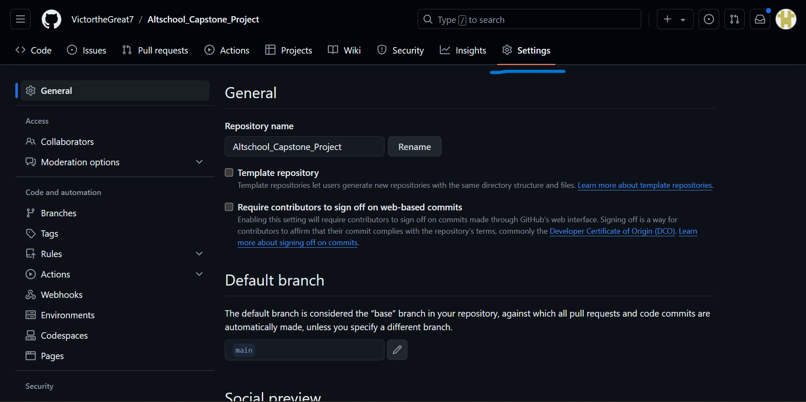
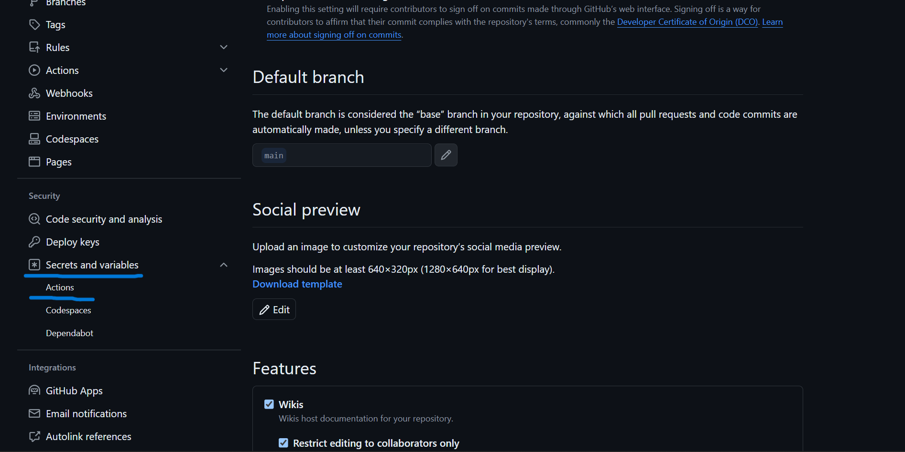
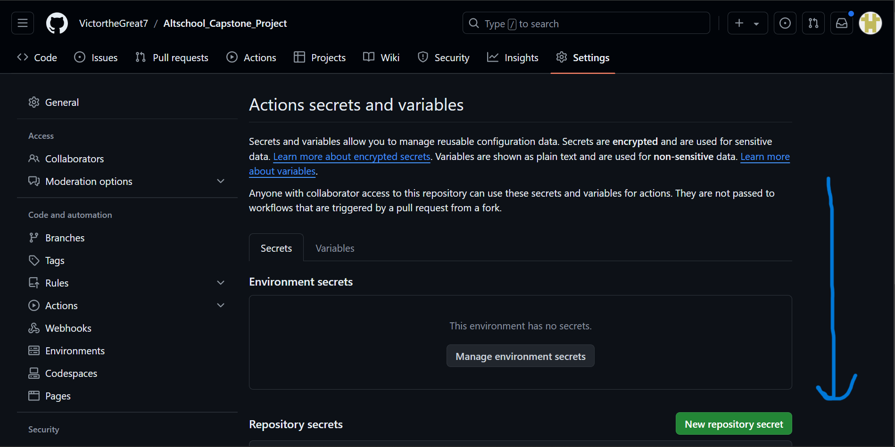
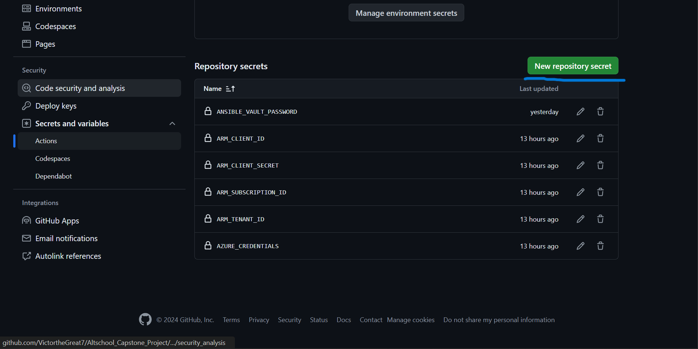
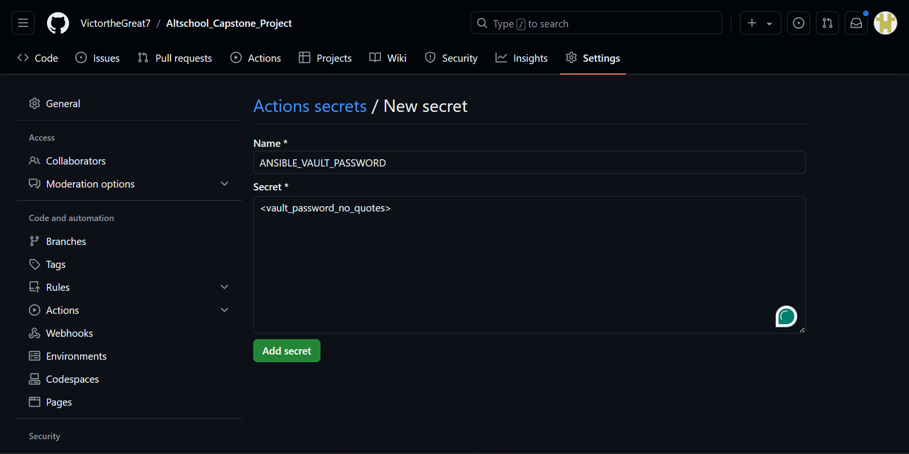
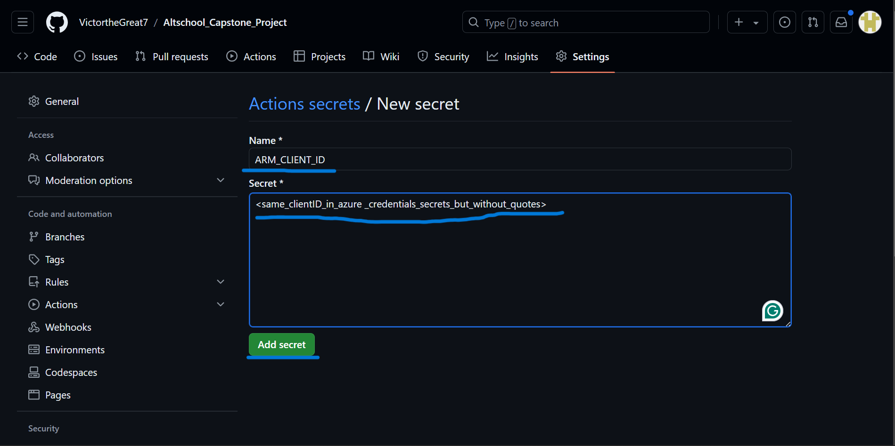
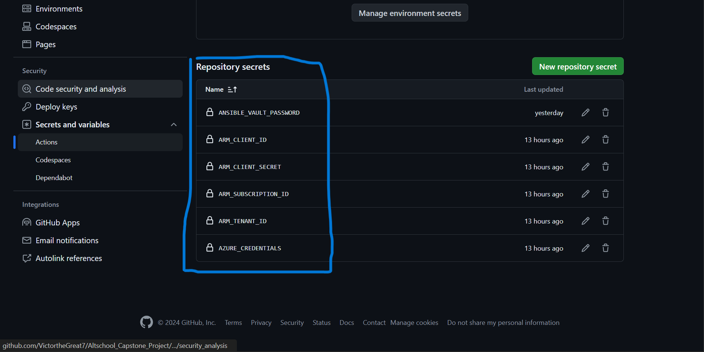

# How to create GitHub Actions Secrets

Go to the `Settings` section of your forked repository

Scroll down. Look for `Secrets and Variables` in the `Security` section of the left pane. Select it, then select `Actions`.

In the `Actions Secrets and Variable` page, scroll down and select `New Repository Secret`

For the first secret, add in the password that you will use to encrypt the [secrets.yaml](../secrets.yaml) file. Name the secret `ANSIBLE_VAULT_PASSWORD` and put in the password (no quotes. just plain text). Make sure to write it down so that you will remember it when you need to encrypt the file in your terminal before `git add`

Follow the same format to create the rest of the secrets except `AZURE_CREDENTIALS`. Makes sure their name are set exactly as they are in the screenshots so that the workflow scripts can find them.

For the `AZURE_CREDENTIALS` secrets, follow this format.

